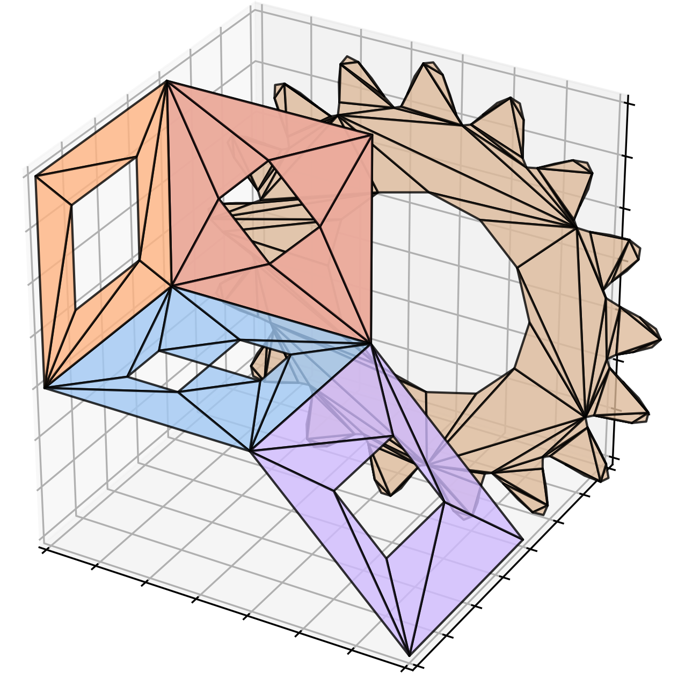

## earcut-py

A pure Python port of the [mapbox/earcut](https://github.com/mapbox/earcut) polygon triangulation library.

- Based off of the earcut 2.2.4 release.
- A small utility `earcut.utils_3d` can be used to project polygons from 3D to 2D space before triangulation, instead of just ignoring z components. (requires NumPy)
- License: ISC

